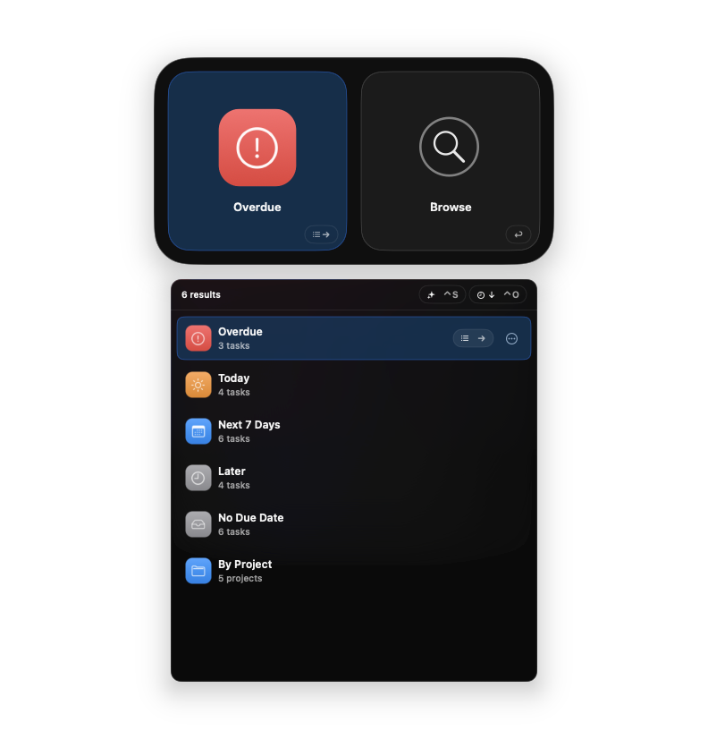
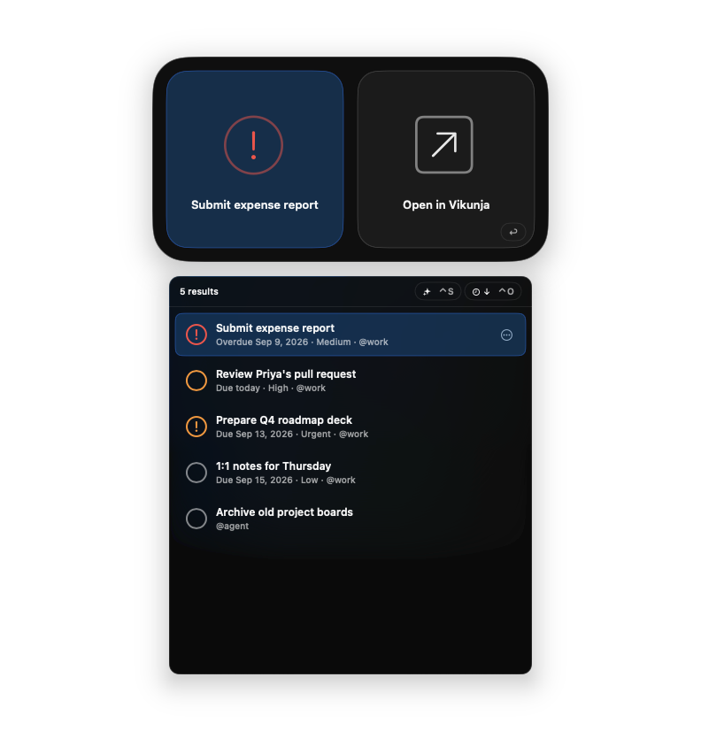
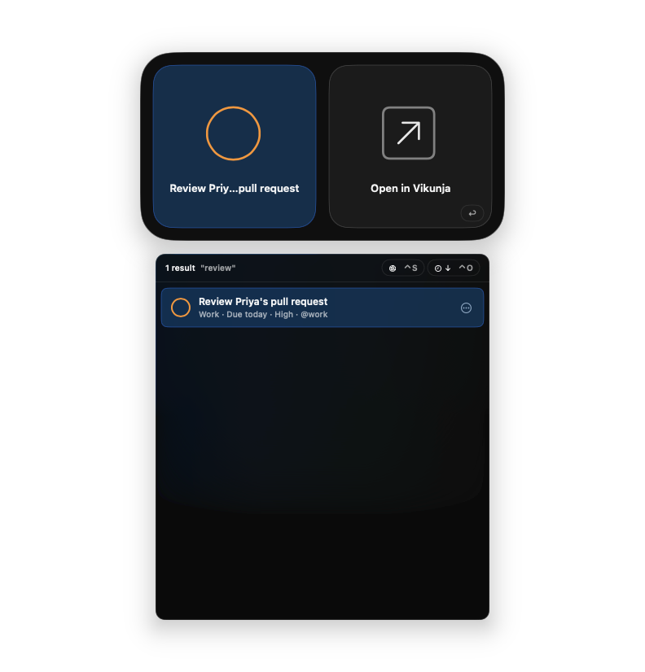
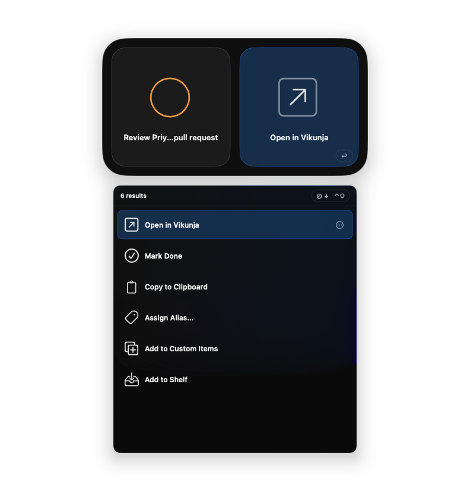
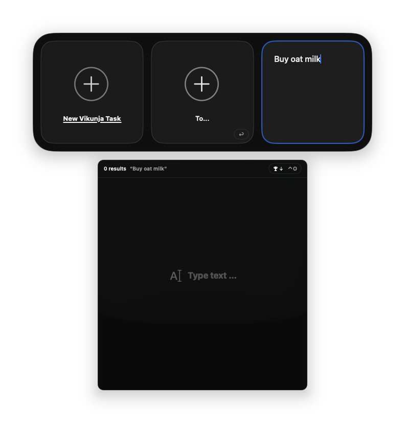

# Vikunja for Tuna

A [Tuna](https://tunaformac.com) extension for a self-hosted [Vikunja](https://vikunja.io)
task manager. Search and browse your open tasks, jump into projects, add tasks from anywhere,
and mark them done without leaving the launcher.

Requires Tuna 0.96 or later (TunaKit 1.22.0) and macOS 15.

| | |
| --- | --- |
|  |  |
|  |  |
|  |  |

## What it adds

**Sources (Settings → Sources → Vikunja)**

| Catalog | ID | What it does |
| --- | --- | --- |
| Vikunja | `vikunja` | Live-search root. Tab → **Search** (or press →) lists every open task sorted by due date and searches server-side as you type (title and description). Tab → **Browse** groups tasks as Overdue, Today, Next 7 Days, Later, and No Due Date, plus a By Project group that drills into each project. Also holds the **New Vikunja Task** quick-capture entry. |
| Projects | `vikunja.projects` | Every non-archived project. Browse into a project to see its sub-projects and open tasks. Projects are also the targets for “Add to Vikunja Project”. Enable global scope for this source if you want project names in root search. |

**Actions (`vikunja.actions`)**

| Action | Applies to | Effect |
| --- | --- | --- |
| Open in Vikunja | task, project | Opens the task or project page in your browser. Default action (Return). Copy to Clipboard yields the link. |
| Mark Done | an open task (batch OK) | `POST /tasks/{id}` with `done: true`, sending the full task back so nothing else changes. |
| Add to Vikunja | text (batch OK) | Creates one task per selected text in the **default project**. |
| Add to Vikunja Project | text, target: a project | Creates the task in the chosen project. The target pane is scoped to your projects and refreshes them when opened. |
| To… | the New Vikunja Task entry, target: typed text | Quick capture: select *New Vikunja Task*, choose *To…*, type the title. |

Task rows show the project, due state (Overdue / Due today / Due tomorrow / Due date),
priority (Vikunja scale, higher is more urgent), and labels. Overdue tasks get a red mark,
urgent ones an orange mark.

## Setup

1. In Vikunja, open **Settings → API Tokens** and create a token with **read and write**
   access to **Projects** and **Tasks** (Tasks read/write is enough for Mark Done and adding;
   Projects read is needed to list projects).
2. In Tuna, open **Settings → Extensions → Vikunja** and click **Add Connection**. Enter your
   server URL (for example `https://tasks.example.com`) and the token. The URL must use
   HTTPS; plain `http://` is refused (except for `localhost`) because the token is sent with
   every request. Several connections (several servers) are supported; results are grouped
   per connection when there is more than one, and a connection that fails shows its error
   in its own group without hiding the others.
3. Optionally change **Default project** in the extension settings. It accepts a project
   title (case-insensitive) or a numeric project id and falls back to *Inbox*, then the first
   project.

## Privacy

The extension talks only to the Vikunja server you configure, over HTTPS, using your API
token from the macOS Keychain (managed by Tuna's connection store). Nothing is sent
anywhere else. Requests are only made when you search, browse, or run an action; there is no
background polling. Project lists are cached in memory for 60 seconds so task rows can show
project names.

Listings are paged from the server. Projects are always fetched in full. Task lists stop at
300 open tasks (100 for a search) to keep the launcher responsive; when a list is cut off,
a “Showing the first N tasks” row says so. Search or open Vikunja to reach the rest.

Writes performed: creating tasks (`PUT /projects/{id}/tasks`) and completing tasks
(`GET` then `POST /tasks/{id}`). The extension never deletes anything; the live API test
suite is the only code path that deletes, and it only deletes the task it created.

## Development

Build, test, and install with the shared repository tooling:

```bash
./scripts/tuna-extension build --scheme VikunjaExtension
./scripts/tuna-extension install --scheme VikunjaExtension --restart
make test
```

`make test` never contacts a Vikunja server. The live API tests (`VikunjaLiveAPITests.swift`)
are opt-in: they skip unless `VIKUNJA_LIVE_TESTS=1` reaches the test process, which with
xcodebuild means prefixing it with `TEST_RUNNER_`:

```bash
TEST_RUNNER_VIKUNJA_LIVE_TESTS=1 make test-extensions
```

Credentials come from `VIKUNJA_TEST_HOST` / `VIKUNJA_TEST_TOKEN` (also `TEST_RUNNER_`-prefixed),
or from the first `~/.netrc` entry whose host mentions `vikunja` or `tasks`
(`machine tasks.example.com login token password API-TOKEN`). They create, complete, and
delete one task named “Tuna extension smoke test” in your Inbox.

Screenshots were taken against a throwaway local Vikunja seeded with invented data.

## Stable identifiers

Catalog, action, and type IDs are public API. Do not rename: `vikunja`, `vikunja.projects`,
`vikunja.actions`, `open-task`, `open-project`, `mark-done`, `add-task`,
`add-task-to-project`, `to`, `com.crosbyh.tuna.type.vikunja-task`,
`com.crosbyh.tuna.type.vikunja-project`, connection provider `vikunja`, setting
`DefaultProject`.

Upstream development happens at <https://github.com/crosbyh/vikunja-for-tuna>.
